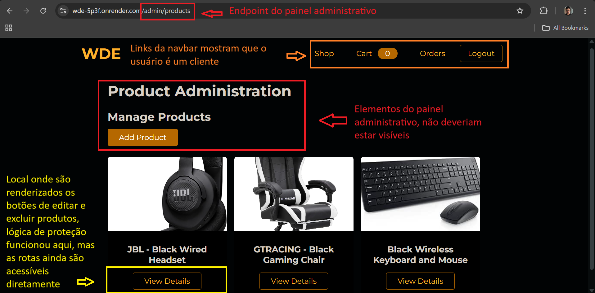
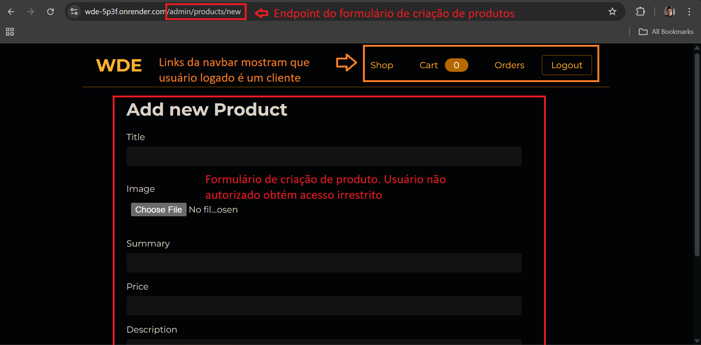
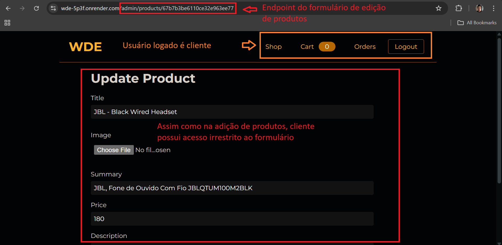

# BUG-AUTH-001: Critical Authorization Failure - Improper Access to Product CRUD by Customer

## Severity

**CRITICAL (HIGH RISK)**

- **Justification:** Extremely severe security vulnerability. Allows unauthorized users (`customer`) to **completely** manipulate the product catalog (adding and editing), leading to potentially catastrophic and widespread financial, operational, reputational, and legal damage to the online store.

## Priority

**IMMEDIATE (MAXIMUM URGENCY / EMERGENCY)**

- **Justification:** Given the CRITICAL severity and the potentially devastating impact, the fix should be treated as an absolute emergency, interrupting other work to focus on the correction.

## Environment

- **Application:** WDE Shop
- **Base URL:** `https://wde-5p3f.onrender.com`
- **Affected Endpoints:**
  - `/admin/products` (allows access to the "Add product" button and viewing)
  - `/admin/products/add` (direct access to the add form - inferred)
  - `/admin/products/edit/:id` (direct access to the edit form)
- **User Profile:** `customer` (non-admin)
- **Browser/OS:** Google Chrome v.134 (or as run via Cypress), Windows 11
- **Test Environment:** Local (Cypress Runner) / CI (GitHub Actions) / Manual (Render)

## Report Details

- **Reported by:** Gabriel Leão
- **Date discovered:** 2025-03-19
- **Original reference:** TC_ADMIN_SECURITY_033 (Jira/Test Case ID)

## Steps to Reproduce

1.  Log in to the WDE Shop application (`https://wde-5p3f.onrender.com`) using credentials for a user with a `customer` profile (e.g. `user@example.com` / `usertest`).
2.  After a successful login (in the customer area), change the URL in the browser's address bar to directly access the admin endpoints:
    - To list products and access the "Add" button: `https://wde-5p3f.onrender.com/admin/products`
    - To edit a product (replace `:id` with a valid ID): `https://wde-5p3f.onrender.com/admin/products/edit/:id`
    - _Implied/Likely:_ To add a product directly: `https://wde-5p3f.onrender.com/admin/products/new`
3.  Observe whether access is granted and whether it's possible to interact with the add/edit forms.
4.  **(Optional/Confirmation):** Try to actually save a change to an existing product or add a new one.
5.  **(Alternative via Automation):** Run the corresponding scenarios in `cypress/integration/admin/features/authorization.feature` that try to access `/admin/products` and `/admin/products/edit/:id` as `customer`.

## Expected Result (Per TC_ADMIN_SECURITY_033)

- The `customer` user **should NOT** be able to access any of the admin product pages/functionality (`/admin/products`, `/admin/products/add`, `/admin/products/edit/:id`).
- The user should be redirected to an authorization error page (e.g. `/403 Forbidden` or `/401 Unauthorized`).
- A clear message such as "Not authorized - you are not authorized to access this page!" should be displayed, informing the user of the lack of permission.

## Actual Result (Critical Security Failure)

- **FAILURE:** The `customer` user **CAN** access the admin panel's product listing, add, and edit pages/forms.
- **FAILURE:** The user is **NOT redirected** to a 403/401 error page. Access to the forms is direct.
- **FAILURE:** No "Not authorized" message is displayed.
- **SERIOUS CONFIRMATION:** It was confirmed that the `customer` user can not only view, but **ACTUALLY ADD NEW PRODUCTS and EDIT EXISTING PRODUCTS** through these improperly accessed forms. Full catalog manipulation is possible.

## Evidence

- **Automated Test (`authorization.feature`):** The corresponding scenarios intentionally fail when trying to access the URLs as `customer`, proving the expected redirect/block failure.
- **Manual Verification:** Direct access to the URLs confirms the admin pages render for the `customer` profile and that the forms can be interacted with.
- **Screenshots/Videos:**
  - 
  - 
  - 
  - [Authorization Tests Execution Video](../../evidence/authorization.feature.mp4) - Screenshots/videos showing customer access to the admin forms and, ideally, confirmation of a successful add/edit.

## Root Cause Analysis (Likely)

- **Total absence or critical failure** in implementing backend **authorization (permission/role) checks** for product management routes and functionality (`/admin/products/*`).
- Protection may be based only on **authentication** (user logged in), completely ignoring the profile/role (`admin` vs `customer`) required to access these functions.

## Potential Impact (Catastrophic)

- **Total Manipulation and Corruption of Product Data:**
  - Mass price changes (to zero, absurd values).
  - Modification of descriptions/titles with false, offensive, illegal content.
  - Replacement of images with inappropriate/illegal content.
  - **Addition of fake, illegal, spam, or competitor products.**
- **Catastrophic Financial Damage:** Loss-making sales, fines, lost revenue and investors.
- **Irreversible Reputational Damage:** Total loss of customer trust, destruction of the brand's image.
- **Unbearable Operational Problems:** Chaos in inventory management, orders, customer service.
- **Serious Legal Risks:** Lawsuits due to illegal content, fake products, terms-of-service violations.

## Recommendations (Urgent and Extreme Actions)

1.  **IMMEDIATE FIX:** Implement robust, uncompromising **role-based authorization** in the **backend** for ALL routes and operations under `/admin/*`, completely blocking unauthorized access (especially for `customer`).
2.  **MANDATORY VERIFICATION:** Ensure the authorization check happens on **every request** to the backend for admin functionality, no exceptions.
3.  **URGENT SECURITY REVIEW:** Perform a full security audit by specialists across the entire application, focusing on access control and authorization.
4.  **AUTOMATED TESTS:** Implement **extensive** automated security tests (covering authorization for every role and admin route) in the CI/CD pipeline to prevent regressions.
5.  **CONTAINMENT MEASURE (Consider):** Evaluate the **immediate** need to take the `/admin` panel offline or restrict access to **only** a minimal group of trusted administrators **until the fix is implemented and validated**, given the extreme severity of the flaw.
