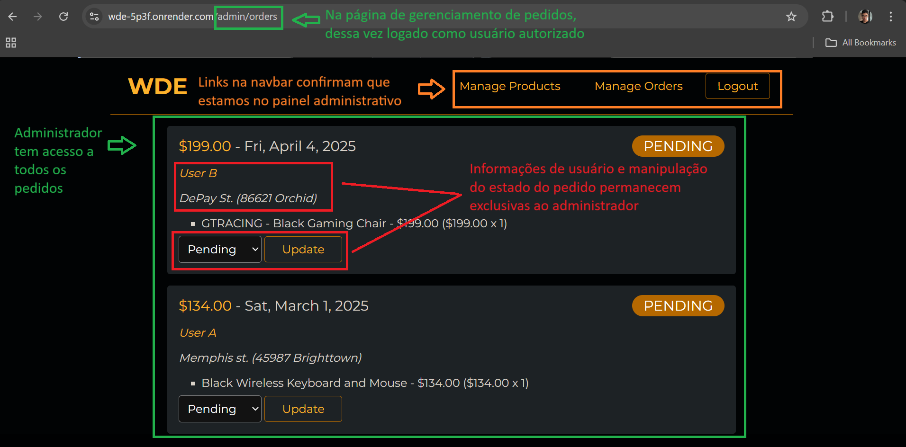
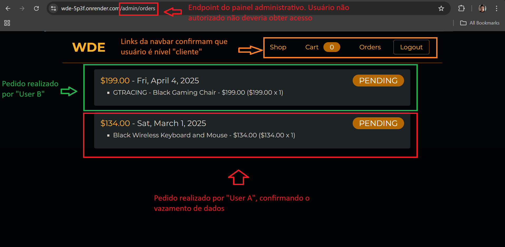
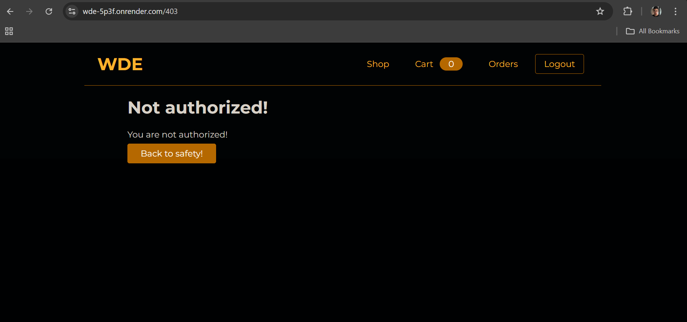

# BUG-AUTH-002: Authorization Failure - Customer Accesses `/admin/orders` and Views Other Users' Orders

## Severity

**High**

- **Justification:** Improper access to an admin area and confirmed viewing of order data belonging to other users constitute a significant privacy and security violation, even though direct PII isn't visible on this specific screen.

## Priority

**High**

- **Justification:** Requires urgent investigation and fixing due to confirmed data exposure and the broken access control.

## Environment

- **Application:** WDE Shop
- **Base URL:** `https://wde-5p3f.onrender.com`
- **Affected Endpoint:** `/admin/orders`
- **User Profile:** `customer`
- **Browser/Runner:** As run via Cypress (e.g. Chrome vXX, Electron vYY)
- **Test Environment:** Local (Cypress Runner) / CI (GitHub Actions)

## Report Details

- **Reported by:** Gabriel Leão
- **Original discovery date:** 2025-03-31
- **Leak confirmation date:** 2025-04-03

## Steps to Reproduce

1.  **Precondition:** Make sure orders previously created by _other users_ exist in the database, to clearly observe the leak. (Running the `purchase_flow.feature` E2E test can create one of these orders.)
2.  Log in to the WDE Shop application (`https://wde-5p3f.onrender.com`) using credentials for a user with a `customer` profile.
3.  After a successful login, navigate directly to `https://wde-5p3f.onrender.com/admin/orders` in the browser's address bar.
4.  **(Alternative via Automation):** Run the corresponding scenario in `cypress/integration/admin/features/authorization.feature` that tries to access `/admin/orders` as `customer`.

## Expected Result

The user with a `customer` profile **should not** be able to access or view any content on the `/admin/orders` page. The application should:

- Redirect the user to a standard authorization error page (e.g. `/401`, `/403`)
- **OR** Redirect the user to their customer home page (e.g. `/`)
- **AND** Display a clear message stating that access to that section isn't allowed for their profile.

## Actual Result

- The user with a `customer` profile **can load** the `/admin/orders` URL without being redirected to an access-denied error page (`/401` or `/403`).
- The page renders **partially or incompletely**:
  - Key admin UI elements (like the "Orders" title) may be missing.
  - Controls specific to data manipulation (like the order-status dropdown and the submit button) aren't shown or are disabled.
- **CONFIRMED DATA LEAK:**
  - Despite the missing controls, the order list structure **loads and displays orders belonging to other users**.
  - Confirmed manually after running the `purchase_flow.feature` E2E test (which created an order for "Customer A"), where a different user ("Customer B", or even an `admin` user) logged in and accessing `/admin/orders` was able to view Customer A's order details (products, date, status).
  - **Observed limitation:** Direct personally identifiable information (PII), such as the customer's full name and address associated with the order, was _not observed_ in this specific `/admin/orders` view as accessed by the `customer` profile. However, order details are exposed.
- No explicit "Not Authorized" message that fully blocks the page content from being viewed is shown prominently.

## Evidence

- **Automated Test (`authorization.feature`):** The corresponding scenario demonstrates improper access to the `/admin/orders` URL by the `customer` profile (the test may fail on the expected redirect assertion or validate an incorrect status code). The _specific assertion for the leak_ of other users' data wasn't automated.
- **Data Generation:** The `purchase_flow.feature` E2E test was used to create a known test order for a `customer` user.
- **Manual Verification:** Visual confirmation performed by accessing `/admin/orders` as another user (`customer` or `admin`) after generating the test order, observing the presence of orders not belonging to the logged-in user.
- **Screenshots/Videos:**
  - 
  - 
  - 
  - [Authorization Tests Execution Video](../../evidence/authorization.feature.mp4)

## Additional Notes / Recommended Action

- This finding confirms the data-leak risk previously raised as "potential" for the `/admin/orders` route.
- **Main action:** Implement a robust authorization check in the **backend** for the `/admin/orders` route. Fully prevent `customer` profile access, preferably returning a `403 Forbidden` or `401 Unauthorized` status and/or redirecting server-side before the page or data is sent to the frontend.
- **Secondary action (Frontend containment):** As an additional measure (not a substitute), the frontend could also implement a profile check and redirect the `customer` user if they try to access the `/admin/orders` route directly.
- **Security review:** A security review of _all_ admin routes (`/admin/*`) is recommended to ensure profile validation (`admin` vs `customer`) is being correctly enforced in the backend.
